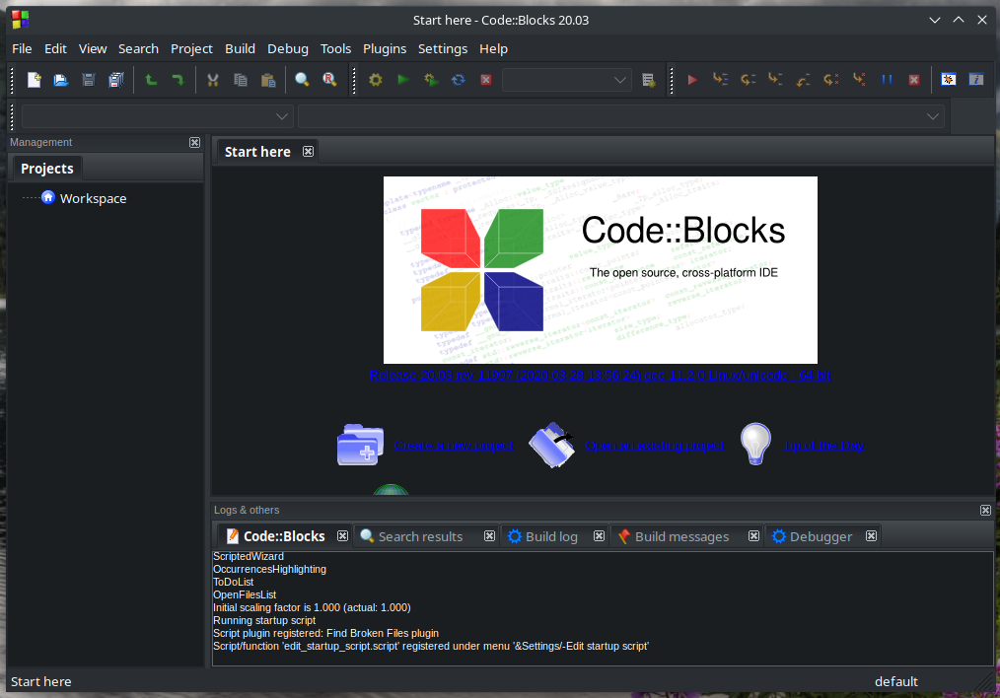

# Code::Blocks

https://www.codeblocks.org/

Code::Blocks is a free C/C++ and Fortran IDE built to meet the most demanding needs of its users. It is designed to be very extensible and fully configurable.

Built around a plugin framework, Code::Blocks can be extended with plugins. Any kind of functionality can be added by installing/coding a plugin. For instance, event compiling and debugging functionality is provided by plugins!

