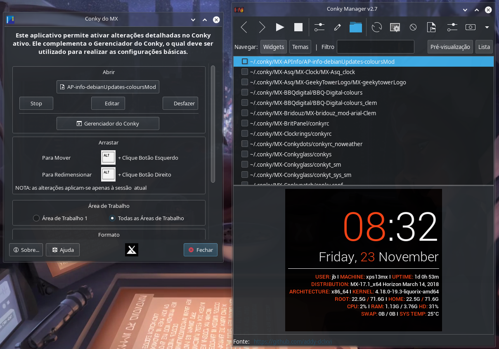

# Conky Complete

https://github.com/zcot/conky-manager2 
https://github.com/MX-Linux/mx-conky 
https://github.com/MX-Linux/mx-conky-data

Conky is a free, light-weight system monitor for X, that displays any kind of information on your desktop. 

- MX-Conky: This app enables detailed changes to the active conky. It supplements Conky Manager, which should be used for basic settings.
- Conky Manager:  Simple tool for managing Conky configs. (Require P7Zip)

