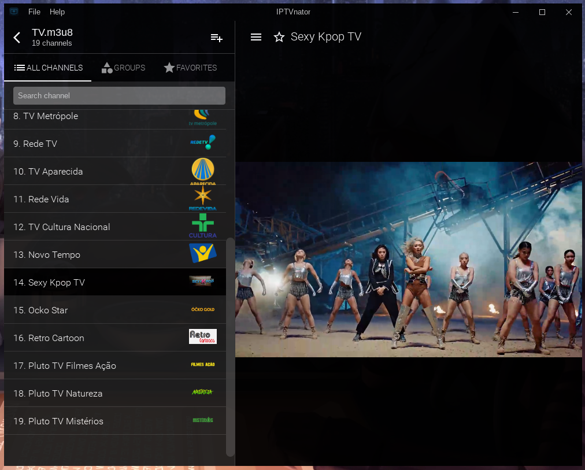

# IPTVnator

https://github.com/4gray/iptvnator

IPTVnator is a video player application that provides support for the playback of IPTV playlists (m3u, m3u8). The application allows to import playlists by using remote URLs or per file upload from the file system. Additionally there is a support of EPG information XMLTV-based which can be provided by URL.

The application is a cross-platform and open source project based on Electron and Angular.

