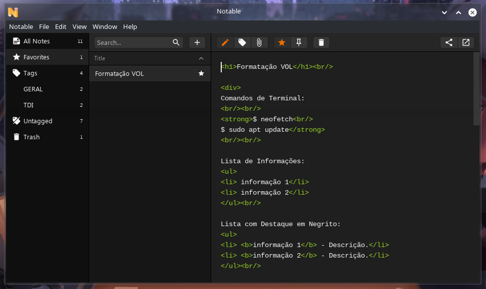

# Notable

https://notable.app/

Notable provides a very powerful Markdown editor, it's the same one VS Code uses in fact, so features like multi-cursors, a minimap and best-in-class syntax highlighting are built-in.

Notes are written in Markdown, plus you can write KaTeX expressions, Mermaid diagrams and more, check out our Markdown cheatsheet.

