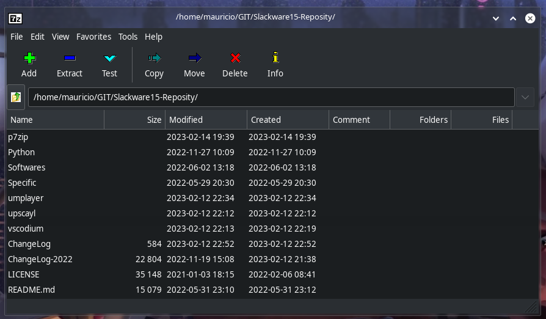

# P7Zip

https://github.com/p7zip-project/p7zip

p7zip is a quick port of 7z.exe and 7za.exe (command line version of 7zip, see www.7-zip.org) for Unix.
7-Zip is a file archiver with highest compression ratio.

