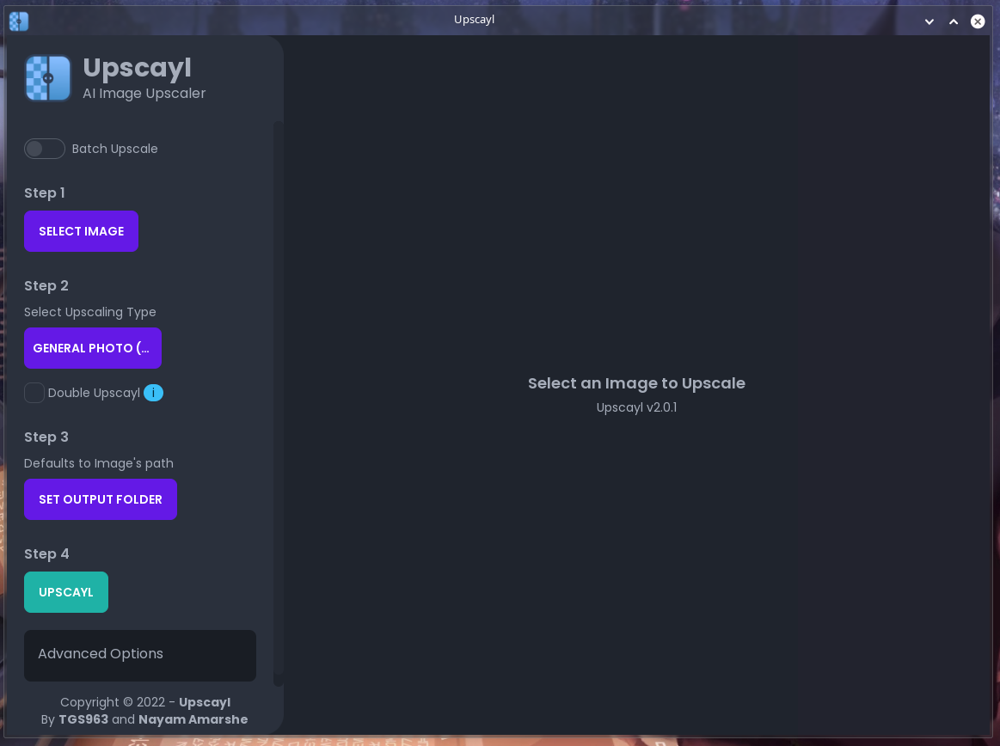

# Upscayl

https://github.com/upscayl/upscayl

Free and Open Source AI Image Upscaler.

Upscayl is a cross-platform application built with the Linux-first philosophy. This means that we prioritize Linux builds over others but that doesn't mean we'll break things for other OS.

