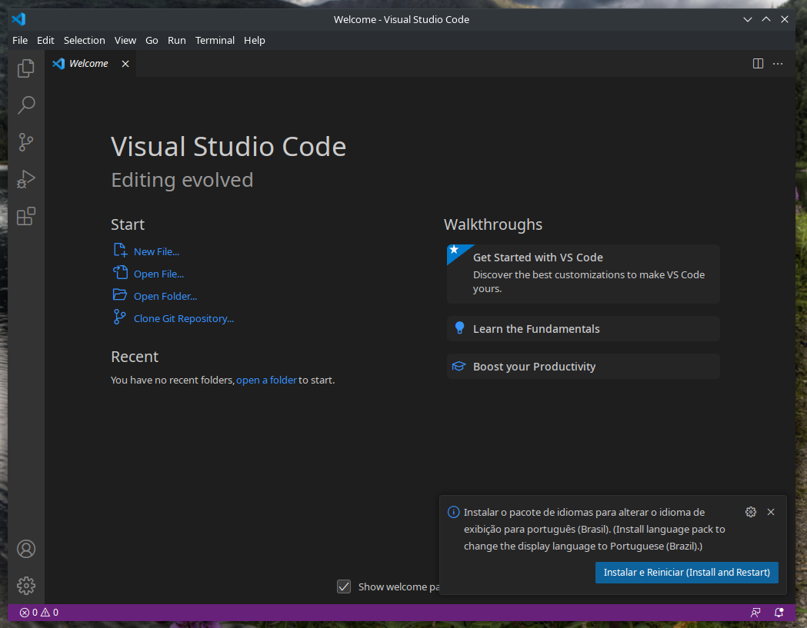

# VSCode

https://code.visualstudio.com/

Visual Studio Code is a lightweight but powerful source code editor which runs on your desktop and is available for Windows, macOS and Linux.
It comes with built-in support for JavaScript, TypeScript and Node.js and has a rich ecosystem of extensions for other languages and runtimes (such as C++, C#, Java, Python, PHP, Go, .NET).

